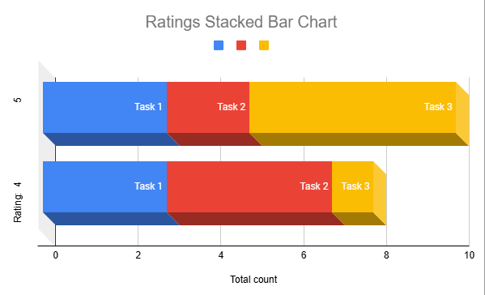

# Phase III: Prototypes and User Testing

## Introduction

CreativeBlock is a productivity application designed to help creative professionals organize their ideas and streamline workflows. The app enables users to create new project ideas, assign priority levels (via a star system), and navigate between projects and tasks efficiently. Our goal for this sprint was to conduct a usability pilot test and gather insights from real new users to improve the design.

## Methods

The CreativeBlock Usability Engineering team conducted pilot usability tests with participants on April 30, 2025 (n = 6). Before testing began, the UX team worked together to finalize the interactive [**prototype**](https://acrobat.adobe.com/id/urn:aaid:sc:VA6C2:b7f0e105-3acc-4fd2-b82a-e58873120bac) of the CreativeBlock application, prepare an [Informed Consent Form](form.pdf), and design a detailed [Protocol/Script](protocol.pdf) for the study. The protocol outlined the overall structure of the evaluation, including the tasks assigned to participants, the sequence of the test session, and the types of data to be collected (both quantitative and qualitative). During planning, the team determined that the primary goal of this usability evaluation was to assess the efficiency, clarity, and user satisfaction of key CreativeBlock features.  
Participants for the study were recruited from Chico State University. The CreativeBlock team posted the participation request to the class communication channel, and six students signed up for the study. The only eligibility requirement was that participants be over the age of 18 and not be part of the CreativeBlock project team.  
Before the pilot test began, each participant was read the Informed Consent Form and asked to sign, ensuring they understood the nature of the study, any potential risks, and their right to withdraw at any time. The facilitator then followed the prepared protocol, beginning with an introduction and a set of background questions aimed at understanding each participant’s prior experience with note-taking or creative productivity tools.  
For the usability test, participants were asked to complete three core tasks on the CreativeBlock prototype: 
- Create a new project idea.
- Adjust the priority level of that project to high.
- Mark off step 1 of that project.
  
The facilitator provided verbal instructions for each task, then observed as participants interacted with the interface. A **think-aloud protocol** was used, encouraging participants to verbalize their thoughts, expectations, and any confusion as they navigated the app. The facilitator recorded task completion times, navigation paths, and points of hesitation or error to assess usability, efficiency, and alignment with user mental models.  
After all tasks were completed, the facilitator conducted a structured debrief interview with each participant. This debrief gathered qualitative feedback on the participants’ impressions of the app’s interface, perceived ease of use, visual design, and overall satisfaction. Participants were also asked to compare CreativeBlock to other note-taking or project management tools they use, providing valuable insights into how CreativeBlock’s design stands out or where improvements could be made.  
Once all sessions were completed, the team compiled the collected data — without any personally identifying information — into a shared [spreadsheet](results.pdf) for further analysis. This dataset provided both quantitative trends (such as ease-of-use ratings and task completion times) and qualitative feedback (such as frustrations, suggestions, and likes/dislikes), which were synthesized to inform recommendations for the next iteration of the CreativeBlock design.
  

## Findings

The **quantitative** results showed that for Task 1, participants gave a mean (average) ease-of-use rating of 4.0 out of 5, with a standard deviation of 1.49, indicating moderate variability in user experiences. For Task 2, the mean rating was 3.85, with a standard deviation of 1.43, reflecting a mix of ease and some difficulty across participants. Task 3 stood out with the highest mean rating of 4.83 and a low standard deviation of 0.41, showing that nearly all participants found this task both easy and consistent in experience.  

Here is a stacked bar chart which visualizes the participants' ease of use ratings split among the 3 tasks:
 
 
 Out of six participants, five reported they would likely use CreativeBlock in their real-world routines, showing strong potential for use beyond the test environment.  

The qualitative feedback gathered during debrief interviews highlighted that participants appreciated the app’s minimalist and modern interface. They especially liked features like the “new project” button and the clear visual priority system. However, several users pointed out confusion about the clickable star priority feature, projects and expressed a desire for more flexibility, such as being able to set project priority during creation and being able to see all the due dates for each project, not just the one that is due soon.  
Overall, both the quantitative (mean ratings and consistency) and qualitative insights suggest that CreativeBlock is well-received in terms of simplicity and design but would benefit from targeted usability improvements to better match user expectations and workflows.
  

## Conclusions
The pilot test showed that the CreativeBlock application was generally well received by participants. Its features aligned well with participants’ expectations and **mental models**, helping them complete tasks efficiently and with minimal confusion. Quantitative results revealed strong mean ease-of-use ratings, especially on the final task, while qualitative feedback highlighted the app’s modern design, intuitive project setup, and clear priority system as major positives. At the same time, participants pointed out areas for improvement, such as making the interactive star-based priority feature, and projects clickable more obvious, due date for each project and allowing easier switching between project tabs. Overall, these findings suggest that CreativeBlock delivers a solid user experience but would benefit from targeted refinements to increase flexibility and clarity.
  

## Caveats

The main limitation of this pilot test was the participant group: 5 out of 6 testers were male college students from Chico State University. Also, all participants were between the ages of 20-30. This introduces potential bias and limits how well the findings apply to broader, more diverse audiences — for example, working professionals, non-students, or users of different genders. Additionally, the CreativeBlock UX team is still developing its experience with usability testing, which may have influenced how smoothly the sessions were run or how deeply the insights were captured. Future research with a more diverse participant pool and refined testing procedures will help strengthen the validity and generalizability of these findings.
