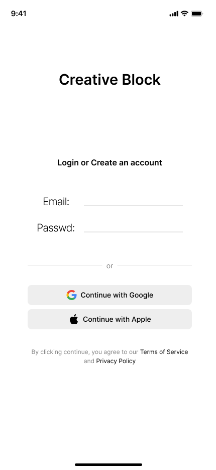
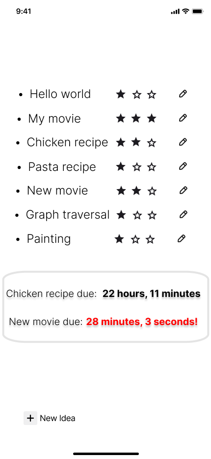
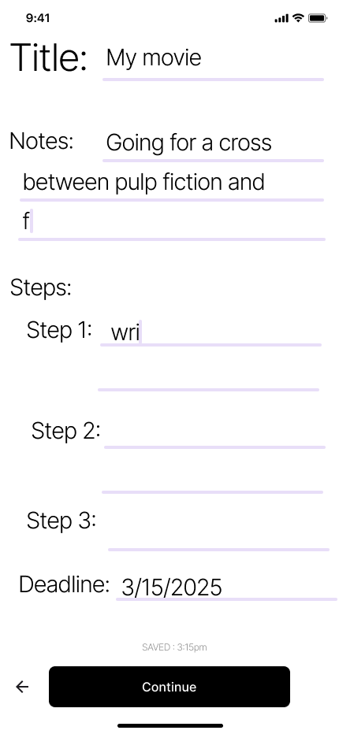
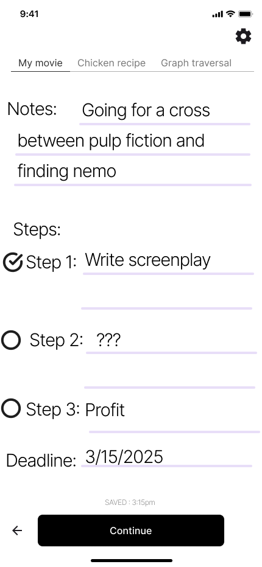

# Wireframes

### **Login Page**
The first screen users encounter is the login/registration interface. Where users can sign in
using various methods. 
  

### **Home Page (Project List)**
After logging in, users are taken to a list of their project ideas.
- Each project has a title and a rating system (stars) to prioritize or indicate status.
- Projects are listed with edit icons for easy editing.
- A deadline countdown is displayed for urgent projects.
- A “+ New Idea” button allows users to quickly create new projects. 
  

### **Project Detail Page (Editing)** 
When a user clicks into a project, they are presented with editable details:
- Title and Notes fields allow for custom project description.
-  Steps are broken into labeled sections (e.g., Step 1, Step 2) with autocomplete AI
suggestions.
- A deadline selector is provided.
- As users type, a real-time “Saved at…” timestamp appears as the note is benign
auto-saved.
  

### **Project Detail Page (Viewing Mode)** 
Users can view and track their project progress:
- A horizontal tab bar at the top allows quick navigation between other projects.
- Each step is shown with icons indicating completion status.
- Notes and deadlines are clearly visible.
- Auto feedback (“Saved at...”) reassures users their work is being saved.
- Improvements like AI integration and visual progress display are annotated based on
Phase II feedback.
  
